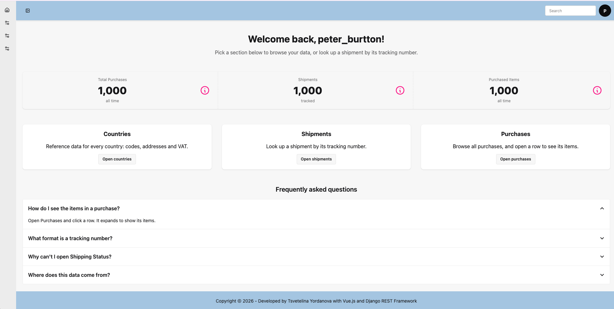

# Purchase Management System: Django REST Framework, Vue.js, Tailwind CSS & daisyUI

A full-stack purchase management system for a small book shop, with a Django REST Framework backend and a Vue.js frontend (styled with Tailwind CSS and daisyUI) that consumes the API.

<p align="center">
  
</p>

<p align="center"><i>More screenshots (login, tables, shipping status) in the <a href="../../wiki/Screenshots">Wiki</a>.</i></p>

## Used Stack

- Django and Django REST Framework (REST API)
- SQLite
- Vue.js 3 (Vite), Vue Router, TanStack Table
- Tailwind CSS and daisyUI
- uv package manager (Python), npm (frontend)

## Setup

**Prerequisites:** Python 3.13, [uv](https://docs.astral.sh/uv/), Node.js

### Backend

```bash
git clone https://github.com/LinaYorda/drf-purchase-api.git
cd drf-purchase-api
uv sync
cp .env.example .env    # fill in your own SECRET_KEY
python manage.py migrate
python manage.py createsuperuser   # follow the prompts to set your own admin login
python manage.py mock_data_simulator      # optional: seeds countries/purchases/purchased items 
python manage.py seed_shipping_mock_data  # optional: generates fake shipping tracking data
python manage.py runserver                # http://localhost:8000
```

### Frontend

In a second terminal, with the backend running:

```bash
cd frontend
npm install
npm run dev      # http://localhost:5173
```

The frontend calls the API at `http://localhost:8000`, so the backend must be running for the tables to load.

### Environment variables

Set these in `.env` (see `.env.example`):

| Variable | Description |
|---|---|
| `SECRET_KEY` | Required. Django will not start without it. |
| `DEBUG` | `True` for local development. Defaults to `False`. |
| `ALLOWED_HOSTS` | Comma-separated list, e.g. `localhost,127.0.0.1`. |

### CORS

The browser only lets the frontend call the API because `http://localhost:5173` is listed in `CORS_ALLOWED_ORIGINS` in `config/settings.py`. If you run the frontend on a different port, add that origin there, or requests will fail with a CORS error.

## API Endpoints

All endpoints are under `/api/`. List endpoints are paginated (100 per page, use `?page=2`).

| Endpoint | Description |
|---|---|
| `/api/countries/` | List of countries |
| `/api/purchases/` | List and create purchases (router-based viewset) |
| `/api/purchased-items/<id>/` | Purchased item detail |
| `/api/shipping-status/<tracking_number>/` | Shipping status by tracking number |
| `/api/login/`, `/api/logout/`, `/api/me/`, `/api/csrf/` | Session-based authentication |

## Project Structure

**Backend**

- purchases/ — core purchase/order logic; mock data generated with Faker.
- countries/ — country reference data (193 real countries, seeded with accurate continents and VAT rates).
- shipping/ — shipping-related models and logic; mock data generated with Faker.
- seeding/ — management commands for populating demo/test data.
- config/ — Django project settings, URLs, WSGI/ASGI entry points.

**Frontend** (`frontend/src/`)

- views/ — pages (Home, Countries, Purchases, Login).
- components/ — shared layout pieces (Header, Sidebar, Footer).
- router/ — route definitions.
- App.vue — page shell: header, collapsible sidebar (daisyUI drawer), content area, footer.

## Status

🚧 Work in progress. Core features (auth, Countries/Purchases/Shipping Status tables, realistic seed data) are working. See the [Roadmap](../../wiki/Roadmap) in the Wiki for the current Done/Planned list.

## License

This project is licensed under the MIT License — see the [LICENSE](LICENSE) file for details.

