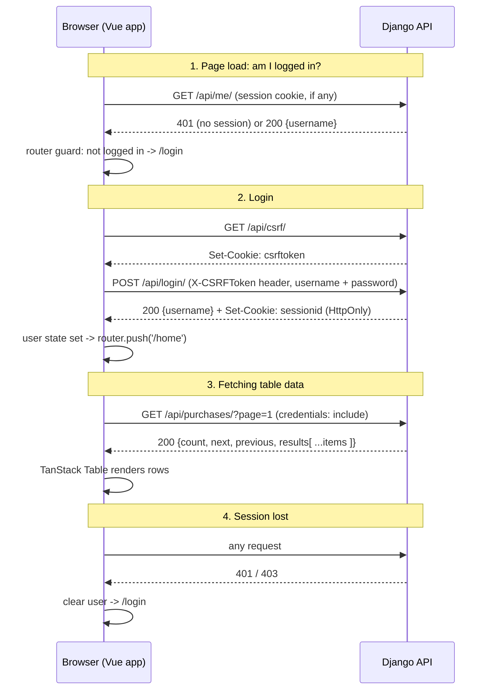

# How the frontend talks to the API

```mermaid
sequenceDiagram
    participant B as Browser (Vue app)
    participant D as Django API

    Note over B,D: 1. Page load: am I logged in?
    B->>D: GET /api/me/ (session cookie, if any)
    D-->>B: 401 (no session) or 200 {username}
    B->>B: router guard: not logged in -> /login

    Note over B,D: 2. Login
    B->>D: GET /api/csrf/
    D-->>B: Set-Cookie: csrftoken
    B->>D: POST /api/login/ (X-CSRFToken header, username + password)
    D-->>B: 200 {username} + Set-Cookie: sessionid (HttpOnly)
    B->>B: user state set -> router.push('/home')

    Note over B,D: 3. Fetching table data
    B->>D: GET /api/purchases/?page=1 (credentials: include)
    D-->>B: 200 {count, next, previous, results[ ...items ]}
    B->>B: TanStack Table renders rows

    Note over B,D: 4. Session lost
    B->>D: any request
    D-->>B: 401 / 403
    B->>B: clear user -> /login
```
